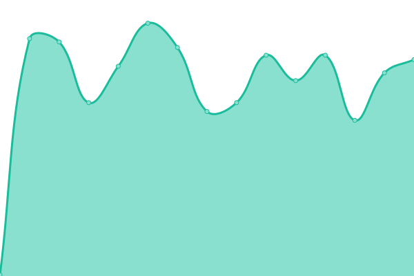

# [📈 Live Status](https://Sheemap.github.io/snazcat-upptime): <!--live status--> **🟩 All systems operational**

This repository contains the open-source uptime monitor and status page for [Sheemap](https://Sheemap.github.io/snazcat-upptime), powered by [Upptime](https://github.com/upptime/upptime).

With [Upptime](https://upptime.js.org), you can get your own unlimited and free uptime monitor and status page, powered entirely by a GitHub repository. We use [Issues](https://github.com/Sheemap/snazcat-upptime/issues) as incident reports, [Actions](https://github.com/Sheemap/snazcat-upptime/actions) as uptime monitors, and [Pages](https://Sheemap.github.io/snazcat-upptime) for the status page.

<!--start: status pages-->
<!-- This summary is generated by Upptime (https://github.com/upptime/upptime) -->
<!-- Do not edit this manually, your changes will be overwritten -->
<!-- prettier-ignore -->
| URL | Status | History | Response Time | Uptime |
| --- | ------ | ------- | ------------- | ------ |
|  Foundry | 🟩 Up | [foundry.yml](https://github.com/Sheemap/snazcat-upptime/commits/HEAD/history/foundry.yml) | 

 1342ms
     
 | 

<a href="https://Sheemap.github.io/snazcat-upptime/history/foundry">99.94%</a>
    

|  [Plex](http://snazcat.com:32400) | 🟩 Up | [plex.yml](https://github.com/Sheemap/snazcat-upptime/commits/HEAD/history/plex.yml) | 

 645ms
     
 | 

<a href="https://Sheemap.github.io/snazcat-upptime/history/plex">100.00%</a>
    

|  [Pterodactyl Panel](https://panel.snazcat.com) | 🟩 Up | [pterodactyl-panel.yml](https://github.com/Sheemap/snazcat-upptime/commits/HEAD/history/pterodactyl-panel.yml) | 

 300ms
     
 | 

<a href="https://Sheemap.github.io/snazcat-upptime/history/pterodactyl-panel">100.00%</a>
    

|  [Plex Requests](https://plexrequests.snazcat.com) | 🟩 Up | [plex-requests.yml](https://github.com/Sheemap/snazcat-upptime/commits/HEAD/history/plex-requests.yml) | 

 593ms
     
 | 

<a href="https://Sheemap.github.io/snazcat-upptime/history/plex-requests">100.00%</a>
    

<!--end: status pages-->

[**Visit our status website →**](https://Sheemap.github.io/snazcat-upptime)

## 📄 License

- Powered by: [Upptime](https://github.com/upptime/upptime)
- Code: [MIT](./LICENSE) © [Sheemap](https://Sheemap.github.io/snazcat-upptime)
- Data in the `./history` directory: [Open Database License](https://opendatacommons.org/licenses/odbl/1-0/)
